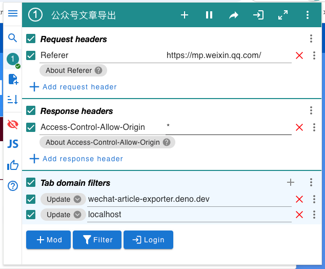

<p align="center">
  
</p>

# wechat-article-exporter

[![Deploy][deploy-badge]][deploy]
![GitHub stars]
![GitHub forks]
![GitHub License]


在线批量导出微信公众号文章，支持内嵌的音视频导出，无需搭建任何环境，可100%还原文章样式，支持私有部署。

交流群(QQ): `991482155`

## 注意

由于免费的代理资源有限，因此推荐 **私有部署 + 搭建私有代理节点** 服用，部署教程在下方。


## :dart: 特性

- [x] 搜索公众号，支持关键字和biz搜索
- [x] 搜索公众号内文章(根据文章标题搜索)
- [x] 导出 html 格式(打包了图片和样式文件，能够保证100%还原文章样式)
- [x] 批量导出 html 格式(zip打包)
- [x] 缓存文章列表数据，减少接口请求次数 (关键字搜索的文章不会进入缓存)
- [x] 支持文章过滤，包括作者、标题、发布时间、原创标识、所属合集等
- [x] 支持合集下载
- [x] 支持内嵌的音视频下载
- [x] 支持图片分享消息
- [x] 支持视频分享消息
- [x] 支持导出评论、阅读量等数据 (需要抓包获取 credentials 信息)
- [ ] 支持订阅机制，根据指定规则自动下载文章


## :hammer: 如何使用

1. 注册一个微信公众号 (已有账号的话跳过)

前往 [微信公众平台] 注册，服务号和订阅号皆可。

2. 二维码扫码登录

进入 [登录页面]，用微信扫描页面上的二维码，然后选择自己的公众号进行登录。

3. 搜索目标公众号，开始下载文章

通过左上角的公众号切换按钮，搜索自己感兴趣的公众号，如下图所示：

![切换账号]


## :rocket: 私有部署

> [!WARNING]
> 由于项目目前还没有进入稳定状态，所以如果进行了私有部署，请随时关注该项目的最新更新，特别是代理部分的变化，后续将会修改使用策略。
> 
> 或者你可以修改`config/index.ts`中的`AVAILABLE_PROXY_LIST`变量，完全使用自己搭建的节点。
> 
> 另外，目前只有部署到 Deno Deploy 的文档，如果需要部署到其他平台，请在 Issue 中说明。

<details>
<summary><span style="font-size: 16px;font-weight: 500;">部署到 Deno Deploy</span></summary>

1. Fork 该项目

![create a fork][create-a-fork]

2. 点击 [New Project][new-deno-deploy-project] 在 Deno Deploy 上面创建一个项目，选择你刚fork的仓库，如下图所示:

![create deno deploy project][create-deno-deploy-project]

创建之后如下所示:

![deno deploy project result][deno-deploy-project-create-result]

3. 修改github仓库发布配置

启用仓库的 workflows (默认fork的仓库是禁用的):

![enable github workflows][enable-github-workflows]

修改`.github/workflows/deno_deploy.yml`:

![update workflows project][update-workflows-project]

提交:

![commit changes][commit-changes]

4. 等待发布结果

![deploy success][deploy-success]

![finally website][finally-website]
</details>


## 内嵌音视频下载
从 2024-10-21 开始，下载机制进行了调整，文章内嵌的 **音视频下载** 需要配合浏览器插件才能下载。

这里推荐用 [ModHeader插件](https://modheader.com/)，插件的配置如下:


<details>
<summary>配置说明</summary>

请求头中添加`Referer`，值为`https://mp.weixin.qq.com/`, 解决页面上图片显示及视频资源下载问题。

响应头中添加`Access-Control-Allow-Origin`，值为`*`, 解决下载资源接口跨域问题。

过滤器添加2个域名：`wechat-article-exporter.deno.dev`和`localhost`，表示只有这些域名发起的请求才会应用这些配置。`localhost`用于本地开发调试。

可复制以下配置直接导入到 ModHeader 插件中:
```json
[
  {
    "headers": [
      {
        "appendMode": false,
        "enabled": true,
        "name": "Referer",
        "value": "https://mp.weixin.qq.com/"
      }
    ],
    "initiatorDomainFilters": [
      {
        "domain": "wechat-article-exporter.deno.dev",
        "enabled": true
      },
      {
        "domain": "localhost",
        "enabled": true
      }
    ],
    "respHeaders": [
      {
        "appendMode": false,
        "enabled": true,
        "name": "Access-Control-Allow-Origin",
        "value": "*"
      }
    ],
    "shortTitle": "1",
    "title": "公众号文章导出",
    "version": 2
  }
]
```
</details>


## :bulb: 原理

在公众号后台写文章时支持搜索其他公众号的文章功能，以此来实现抓取指定公众号所有文章的目的。


## :earth_americas: 关于代理池

数据的下载采用代理池的思路，以便解决跨域、防盗链、加速等一系列问题。

目前有以下代理节点:
```
https://vproxy-01.deno.dev
https://vproxy-02.deno.dev
https://vproxy-03.deno.dev (本月额度已用完，刷新时间: 2024-11-02 at 19:59:12)
https://vproxy-04.deno.dev (本月额度已用完，刷新时间: 2024-11-02 at 19:59:12)
https://vproxy-05.deno.dev (本月额度已用完，刷新时间: 2024-11-08 at 12:22:38)
https://vproxy-06.deno.dev (本月额度已用完，刷新时间: 2024-11-08 at 12:22:38)
https://vproxy-07.deno.dev
https://vproxy-08.deno.dev
https://vproxy-09.deno.dev
https://vproxy-10.deno.dev
https://vproxy-11.deno.dev
https://vproxy-12.deno.dev
https://vproxy-13.deno.dev
https://vproxy-14.deno.dev
https://vproxy-15.deno.dev
https://vproxy-16.deno.dev
https://vproxy-01.jooooock.workers.dev
https://vproxy-02.jooooock.workers.dev
```

> 以上节点都是部署在 Deno Deploy / Cloudflare Workers 上面的免费账户中，算是白嫖了这些托管平台的流量。
>
> 目前这些节点都是公开的，后续打算加入签名验证机制，防止被恶意盗刷。

代理节点代码 (未进行签名验证，请酌情使用):

<details>
<summary>Deno Deploy</summary>

```ts
function error(msg: Error | string) {
    return new Response(msg instanceof Error ? msg.message : msg, {
        status: 403,
    });
}

async function wfetch(url: string, opt: Record<string, string> = {}) {
    if (!opt) {
        opt = {};
    }
    const options: Record<string, any> = {
        method: "GET",
        headers: {
            "User-Agent":
                "Mozilla/5.0 (Windows NT 10.0; Win64; x64) AppleWebKit/537.36 (KHTML, like Gecko) Chrome/100.0.0.0 Safari/537.36",
        },
    };
    if (opt.referer) {
        options.headers["Referer"] = opt.referer;
    }

    return await fetch(url, options);
}

Deno.serve(async (req: Request) => {
    if (req.method.toLowerCase() !== "get") {
        return error("Method not allowed");
    }

    const origin = req.headers.get("origin")!;
    const { searchParams } = new URL(req.url);
    let url = searchParams.get("url");
    if (!url) {
        return error("url cannot empty");
    }

    url = decodeURIComponent(url);
    console.log("proxy url:", url);

    if (!/^https?:\/\//.test(url)) {
        return error("url not valid");
    }

    const response = await wfetch(url);

    return new Response(response.body, {
        headers: {
            "Access-Control-Allow-Origin": origin,
            "Content-Type": response.headers.get("Content-Type")!,
        },
    });
});
```
</details>

<details>
<summary>Cloudflare Worker</summary>

```js
function error(msg) {
    return new Response(msg instanceof Error ? msg.message : msg, {
        status: 403,
    });
}

async function wfetch(url, opt = {}) {
    if (!opt) {
        opt = {};
    }
    const options = {
        method: "GET",
        headers: {
            "User-Agent":
                "Mozilla/5.0 (Windows NT 10.0; Win64; x64) AppleWebKit/537.36 (KHTML, like Gecko) Chrome/100.0.0.0 Safari/537.36",
        },
    };
    if (opt.referer) {
        options.headers["Referer"] = opt.referer;
    }

    return await fetch(url, options);
}


export default {
  async fetch(req, env, ctx) {
    if (req.method.toLowerCase() !== "get") {
        return error("Method not allowed");
    }

    const origin = req.headers.get("origin");
    const { searchParams } = new URL(req.url);
    let url = searchParams.get("url");
    if (!url) {
        return error("url cannot empty");
    }

    url = decodeURIComponent(url);
    console.log("proxy url:", url);

    if (!/^https?:\/\//.test(url)) {
        return error("url not valid");
    }

    const response = await wfetch(url);

    return new Response(response.body, {
        headers: {
            "Access-Control-Allow-Origin": origin,
            "Content-Type": response.headers.get("Content-Type"),
        },
    });
  },
};
```
</details>


## 关于导出其他格式
本项目暂不支持除`html`格式之外的其他格式，很大一部分原因是样式很难保真。如果需要其他格式，可以寻找其他格式转换工具。

> PDF格式可参考: https://github.com/colin4k/wechat-article-dl


## 常见问题
请参考 [faq](docs/faq.md) 文档，如果遇到其他使用问题，欢迎在 Issue 中说明。

## :heart: 感谢

- 感谢 [Deno Deploy]、[Cloudflare Workers] 提供免费托管服务
- 感谢 [WeChat_Article] 项目提供原理思路


## :coffee: 支持

如果你觉得本项目帮助到了你，请给作者一个免费的 Star，感谢你的支持！


## 关于后续更新计划

后续会区分出 **免费版** 和 **Pro版**，区别如下:

### 免费版
- 所有现有功能
- 所有现有的代理节点
- 现有功能的bug修复

### Pro版
- 订阅自动下载服务
- 更多专用代理节点

> 目前只是有这个计划，并没有开始实施。对于之前有赞赏行为的用户，可提供优惠政策。

## :star: Star 历史

[![Star History Chart]][Star History Chart Link]


## :memo: 许可

MIT

<!-- Definitions -->

[deploy-badge]: https://img.shields.io/github/actions/workflow/status/jooooock/wechat-article-exporter/.github%2Fworkflows%2Fdeno_deploy.yml?label=Deploy

[deploy]: https://github.com/jooooock/wechat-article-exporter/actions

[Github stars]: https://img.shields.io/github/stars/jooooock/wechat-article-exporter?style=social&label=Star&style=plastic

[Github forks]: https://img.shields.io/github/forks/jooooock/wechat-article-exporter?style=social&label=Fork&style=plastic

[Github License]: https://img.shields.io/github/license/jooooock/wechat-article-exporter?label=License

[微信公众平台]: https://mp.weixin.qq.com/cgi-bin/registermidpage?action=index&lang=zh_CN

[登录页面]: https://wechat-article-exporter.deno.dev/login

[切换账号]: assets/switch-account.png

[create-a-fork]: assets/deploy/create-fork.png

[new-deno-deploy-project]: https://dash.deno.com/new_project

[create-deno-deploy-project]: assets/deploy/create-deno-deploy-project.png

[deno-deploy-project-create-result]: assets/deploy/deno-deploy-project-result.png

[enable-github-workflows]: assets/deploy/enable-github-workflows.png

[update-workflows-project]: assets/deploy/update-workflows-project.png

[commit-changes]: assets/deploy/commit-changes.png

[deploy-success]: assets/deploy/deploy-success.png

[finally-website]: assets/deploy/finally-website.png

[Deno Deploy]: https://deno.com/deploy

[Cloudflare Workers]: https://workers.cloudflare.com

[Wechat_Article]: https://github.com/1061700625/WeChat_Article

[Star History Chart]: https://api.star-history.com/svg?repos=jooooock/wechat-article-exporter&type=Timeline

[Star History Chart Link]: https://star-history.com/#jooooock/wechat-article-exporter&Timeline
