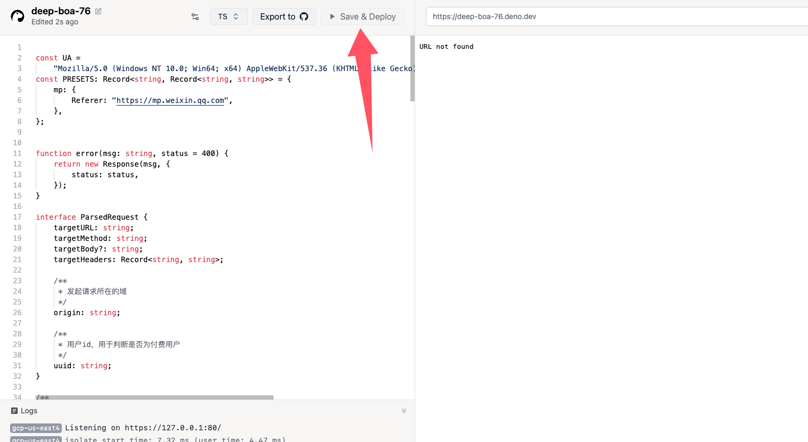
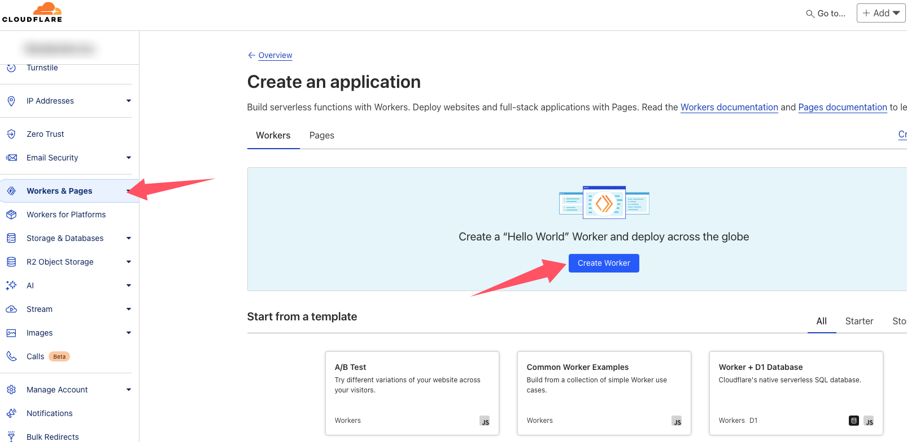
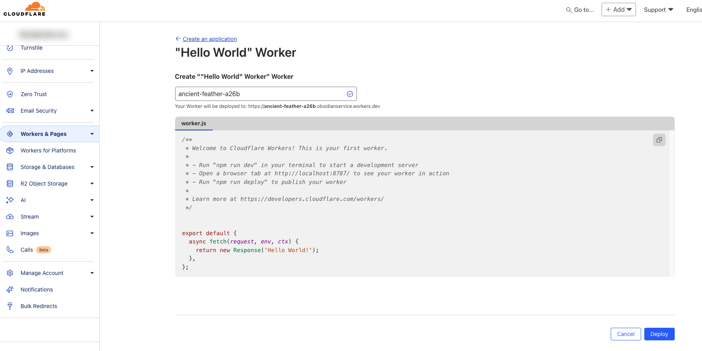
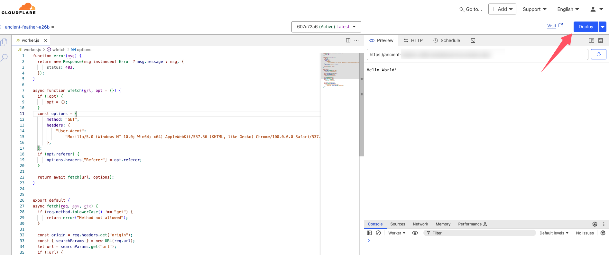

# 搭建私有代理节点


## 部署到 Deno Deploy

在 Deno Deploy 控制台点击`New Playground`，创建一个项目，如下：


将下面的代码拷贝到左侧代码编辑区，并点击`Save & Deploy`按钮：



保存成功后，后侧会出现`URL not found`提示，表示代理搭建完成。

复制右侧地址栏中的地址(https://deep-boa-76.deno.dev)，配置进页面中即可使用。

> 代码版本: v2

```ts

const UA =
    "Mozilla/5.0 (Windows NT 10.0; Win64; x64) AppleWebKit/537.36 (KHTML, like Gecko) Chrome/100.0.0.0 Safari/537.36";
const PRESETS: Record<string, Record<string, string>> = {
    mp: {
        Referer: "https://mp.weixin.qq.com",
    },
};


function error(msg: string, status = 400) {
    return new Response(msg, {
        status: status,
    });
}

interface ParsedRequest {
    targetURL: string;
    targetMethod: string;
    targetBody?: string;
    targetHeaders: Record<string, string>;

    /**
     * 发起请求所在的域
     */
    origin: string;

    /**
     * 用户id，用于判断是否为付费用户
     */
    uuid: string;
}

/**
 * 解析请求
 */
async function parseRequest(req: Request) {
    const origin = req.headers.get("origin")!;

    // 代理目标的请求参数
    let targetURL: string = '';
    let targetMethod = "GET";
    let targetBody: string = '';
    let targetHeaders: Record<string, string> = {};
    let uuid: string = '';
    let preset: string = '';

    const method = req.method.toLowerCase();
    if (method === "get") {
        // GET
        // ?url=${encodeURIComponent(https://example.com?a=b)}&method=GET&headers=${encodeURIComponent(JSON.stringify(headers))}
        const { searchParams } = new URL(req.url);
        if (searchParams.has("url")) {
            targetURL = decodeURIComponent(searchParams.get("url")!);
        }
        if (searchParams.has("method")) {
            targetMethod = searchParams.get("method")!;
        }
        if (searchParams.has("body")) {
            targetBody = decodeURIComponent(searchParams.get("body")!);
        }
        if (searchParams.has("headers")) {
            try {
                targetHeaders = JSON.parse(
                    decodeURIComponent(searchParams.get("headers")!),
                );
            } catch (_: unknown) {
                throw new Error("headers not valid");
            }
        }
        if (searchParams.has("uuid")) {
            uuid = decodeURIComponent(searchParams.get("uuid")!);
        }
        if (searchParams.has("preset")) {
            preset = decodeURIComponent(searchParams.get("preset")!);
        }
    } else if (method === "post") {
        // POST
        /**
         * payload(json):
         * {
         *   url: 'https://example.com',
         *   method: 'PUT',
         *   body: 'a=1&b=2',
         *   headers: {
         *     Cookie: 'name=root'
         *   },
         *   uuid: '',
         *   preset: '',
         * }
         */
        const payload = await req.json();
        if (payload.url) {
            targetURL = payload.url;
        }
        if (payload.method) {
            targetMethod = payload.method;
        }
        if (payload.body) {
            targetBody = payload.body;
        }
        if (payload.headers) {
            targetHeaders = payload.headers;
        }
        if (payload.uuid) {
            uuid = payload.uuid;
        }
        if (payload.preset) {
            preset = payload.preset;
        }
    } else {
        throw new Error("Method not implemented");
    }

    if (!targetURL) {
        throw new Error("URL not found");
    }
    if (!/^https?:\/\//.test(targetURL)) {
        throw new Error("URL not valid");
    }
    if (targetMethod === "GET" && targetBody) {
        throw new Error("GET method can't has body");
    }
    if (Object.prototype.toString.call(targetHeaders) !== "[object Object]") {
        throw new Error("Headers not valid");
    }
    if (!targetHeaders["User-Agent"]) {
        targetHeaders["User-Agent"] = UA;
    }

    // 增加预设
    if (preset in PRESETS) {
        Object.assign(targetHeaders, PRESETS[preset]);
    }

    return {
        origin,
        targetURL,
        targetMethod,
        targetBody,
        targetHeaders,
        uuid,
    };
}

/**
 * 代理请求
 */
function wfetch(url: string, method: string, body?: string, headers: Record<string, string> = {}) {
    return fetch(url, {
        method: method,
        body: body || undefined,
        headers: {
            ...headers,
        },
    });
}


Deno.serve(async (req: Request, info: Deno.ServeHandlerInfo) => {
    try {
        const {
            origin,
            targetURL,
            targetMethod,
            targetBody,
            targetHeaders,
            uuid,
        } = await parseRequest(req);

        // 代理请求
        const response = await wfetch(
            targetURL,
            targetMethod,
            targetBody,
            targetHeaders,
        );

        return new Response(response.body, {
            headers: {
                "Access-Control-Allow-Origin": origin,
                "Content-Type": response.headers.get("Content-Type")!,
            },
        });
    } catch (err: any) {
        return error(err.message);
    }
});
```

## 部署到 Cloudflare Workers

在控制台的左侧`Workers & Pages`菜单中点击创建 Worker，创建一个新的 worker，如下所示：




部署之后，点击【编辑代码】，将下面的代码粘贴到左侧编辑区：




发布成功之后，同样地址栏中的地址即为代理地址。

> 代码版本: v1

```js
function error(msg) {
    return new Response(msg instanceof Error ? msg.message : msg, {
        status: 403,
    });
}

async function wfetch(url, opt = {}) {
    if (!opt) {
        opt = {};
    }
    const options = {
        method: "GET",
        headers: {
            "User-Agent":
                "Mozilla/5.0 (Windows NT 10.0; Win64; x64) AppleWebKit/537.36 (KHTML, like Gecko) Chrome/100.0.0.0 Safari/537.36",
        },
    };
    if (opt.referer) {
        options.headers["Referer"] = opt.referer;
    }

    return await fetch(url, options);
}


export default {
  async fetch(req, env, ctx) {
    if (req.method.toLowerCase() !== "get") {
        return error("Method not allowed");
    }

    const origin = req.headers.get("origin");
    const { searchParams } = new URL(req.url);
    let url = searchParams.get("url");
    if (!url) {
        return error("url cannot empty");
    }

    url = decodeURIComponent(url);
    console.log("proxy url:", url);

    if (!/^https?:\/\//.test(url)) {
        return error("url not valid");
    }

    const response = await wfetch(url);

    return new Response(response.body, {
        headers: {
            "Access-Control-Allow-Origin": origin,
            "Content-Type": response.headers.get("Content-Type"),
        },
    });
  },
};
```
